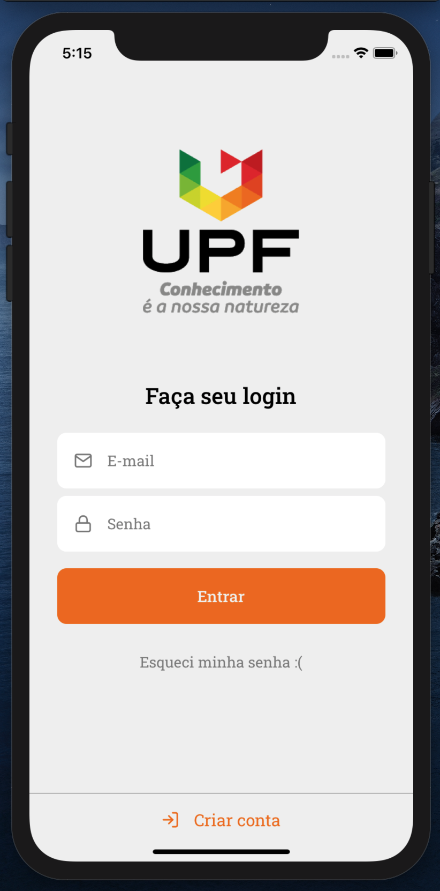
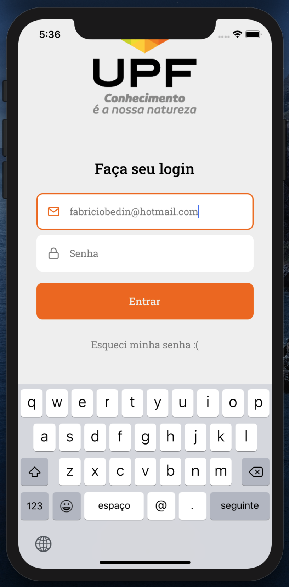
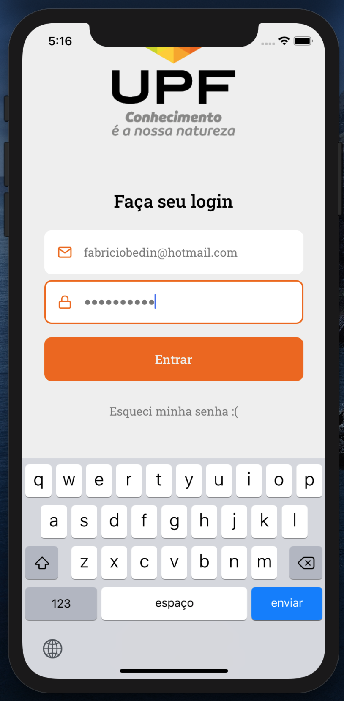

# UPF Eventos

## Instalation
```sh
yarn install   # to install dependencies
yarn ios       # to run the app in iOS
yarn android   # to run the app in Android
```

## Screens
<div width="100%" align="center">



</div>
